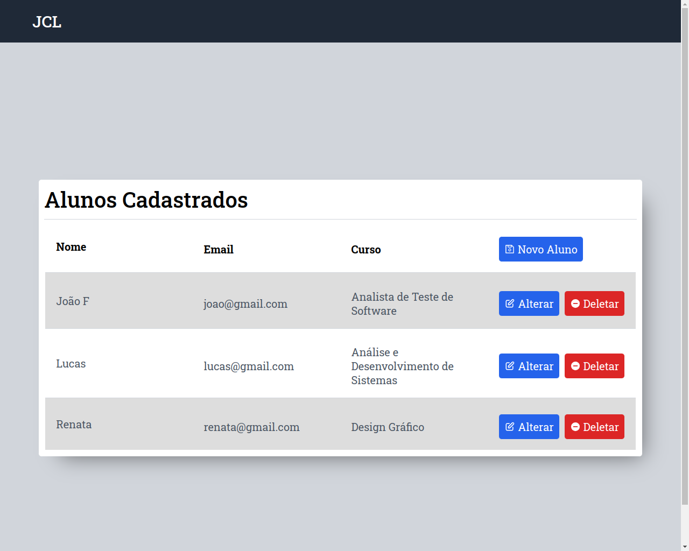
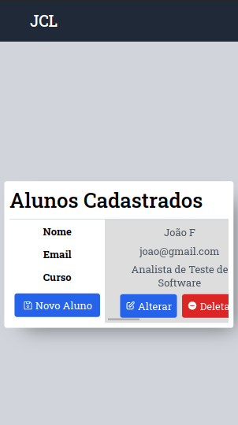

# JCL Front-end

Front-end da aplicação de cadastro de alunos feita com React.js.

- O projeto foi desenvolvido com React.js utilizando Vite, JavaScript, Axios e Styled-components.

## Índice

- [Visão Geral](#visao-geral)
  - [Screenshots](#screenshots)
  - [Links](#links)
  - [Como rodar o projeto](#como-rodar-o-projeto)
- [Autor](#autor)

## Visao Geral

### Screenshots

### Links

- URL do repositório: [Código](https://github.com/thiagoa-martins/jcl-test-front)

### Como rodar o projeto

- Acesse o site: [Site](https://jcltest.netlify.app/)

#### Caso queira rodar na máquina

- `npm i` para instalar as dependências
- `npm run dev` para rodar o projeto
- Acesse a url disponibilizada

## Autor

- Github - [thiagoa-martins](https://github.com/thiagoa-martins)
- Linkedin - [thiagoa-martins](https://www.linkedin.com/in/thiagoa-martins/)
